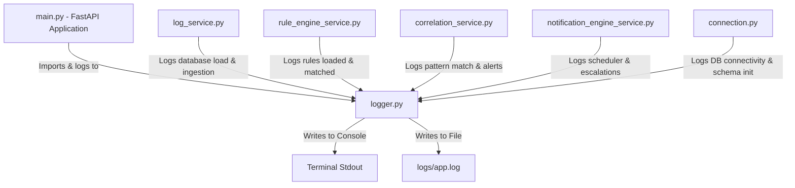

# Operational Logging System Summary

This document provides a detailed overview of the operational logging system, specifically explaining the purpose, configuration, contents, and connection of the `logs` folder and the `app.log` file within the Cyber Security Operation Platform.

---

## 1. Overview of the `logs/` Folder

The `logs/` directory is located at the root of the project workspace. It contains:
- **`app.log`**: The active, centralized operational log file.
- **`.gitkeep`**: A placeholder file to ensure the empty directory is tracked by version control (Git) without committing local log files.

### Why is `app.log` here?
The `app.log` file serves as the core operational log file for the backend services. It captures all server events, background job status updates, database initialization steps, and integration actions. This file is vital for:
- **Troubleshooting and Debugging**: Identifying why a background task failed, a database query errored, or an email wasn't sent.
- **Monitoring Health**: Keeping track of system startups, shutdowns, and periodic tasks (like alert escalations).
- **Audit Trails**: Recording admin-initiated actions, database seeding, and startup configurations.

---

## 2. Configuration & Connection Details

The logging behavior is defined in [logger.py](file:///c:/Bestowal%20Projects/Cyber-Security-Operation-Platform-/backend/app/utils/logger.py).

### How it is Configured:
```python
import logging
from pathlib import Path

# Automatically resolves the logs directory at the project root
LOG_DIR = Path(__file__).resolve().parents[3] / "logs"
LOG_DIR.mkdir(parents=True, exist_ok=True)

logging.basicConfig(
    level=logging.INFO,
    format="%(asctime)s | %(levelname)s | %(name)s | %(message)s",
    handlers=[
        logging.StreamHandler(),                  # Outputs to terminal console
        logging.FileHandler(LOG_DIR / "app.log"), # Appends to logs/app.log
    ],
)

logger = logging.getLogger("soc_platform")
```

### Core Connections:
Every key backend service and repository imports the `logger` object from `app.utils.logger` to log activities. A list of key modules connected to this logger includes:
* **API Entrypoint**: [main.py](file:///c:/Bestowal%20Projects/Cyber-Security-Operation-Platform-/backend/app/main.py)
* **Ingestion & Parsing**: [log_service.py](file:///c:/Bestowal%20Projects/Cyber-Security-Operation-Platform-/backend/app/services/log_service.py), [parsing_service.py](file:///c:/Bestowal%20Projects/Cyber-Security-Operation-Platform-/backend/app/services/parsing_service.py), [log_type_detection_service.py](file:///c:/Bestowal%20Projects/Cyber-Security-Operation-Platform-/backend/app/services/log_type_detection_service.py)
* **Detection & Analysis Layers**: [rule_engine_service.py](file:///c:/Bestowal%20Projects/Cyber-Security-Operation-Platform-/backend/app/services/rule_engine_service.py), [correlation_service.py](file:///c:/Bestowal%20Projects/Cyber-Security-Operation-Platform-/backend/app/services/correlation_service.py), [alert_engine_service.py](file:///c:/Bestowal%20Projects/Cyber-Security-Operation-Platform-/backend/app/services/alert_engine_service.py)
* **Incidents & Escalations**: [incident_service.py](file:///c:/Bestowal%20Projects/Cyber-Security-Operation-Platform-/backend/app/services/incident_service.py), [notification_engine_service.py](file:///c:/Bestowal%20Projects/Cyber-Security-Operation-Platform-/backend/app/services/notification_engine_service.py)
* **Database Access**: [connection.py](file:///c:/Bestowal%20Projects/Cyber-Security-Operation-Platform-/backend/app/database/connection.py) and various repository modules (e.g. `log_repository.py`, `rule_repository.py`, `alert_repository.py`)

---

## 3. What Logs are Written Here? (Examples & Details)

Multiple categories of operational logs are continuously appended to `app.log`.

### A. Application Lifecycle Logs
Indicates when services spin up or down.
> `2026-07-22 12:33:19,592 | INFO | soc_platform | Escalation background scheduler stopped`
> `2026-07-23 10:00:00,000 | INFO | soc_platform | SOC Platform API started`

### B. Database Schema & Auto-Seeding Info
Details automated migrations and default database population.
> `2026-07-22 10:15:00,105 | INFO | soc_platform | [DB] Starting automatic database schema initialization...`
> `2026-07-22 10:15:01,230 | INFO | soc_platform | [DB] Database schema initialized successfully.`
> `2026-07-22 10:15:01,245 | INFO | soc_platform | [DB] detection_rules table is empty. Auto-seeding default rules...`

### C. Background Task Scheduler Events (APScheduler)
Confirms successful or failed execution of background intervals, such as scanning for alert escalations.
> `2026-07-22 12:31:59,536 | INFO | apscheduler.executors.default | Running job "NotificationEngineService.check_and_trigger_escalations..."`
> `2026-07-22 12:31:59,542 | INFO | apscheduler.executors.default | Job "NotificationEngineService.check_and_trigger_escalations..." executed successfully`

### D. Incident Notification & Mail Dispatch Info
Tracks when incident notifications are processed, generated, and dispatched to analysts or administrators.
> `2026-07-22 12:18:59,567 | INFO | soc_platform | [INFO] Email Subject Generated: [HIGH][L1][ESCALATED] Suspicious Activity Detected...`
> `2026-07-22 12:19:03,463 | INFO | soc_platform | [Email Dispatch] Successfully sent to analyst@soc.local | Subject: ...`

---

## 4. Key Distinction: Operational Logs vs. Security Event Logs

It is critical to distinguish between the two types of logs processed by the system:

| Aspect | Operational Logs (`logs/app.log`) | Security Event Logs (Ingested Data) |
| :--- | :--- | :--- |
| **Source** | The SOC platform backend software itself. | External machines, servers, firewalls, and active directories. |
| **Purpose** | Diagnostic output for system administrators & developers. | Cyber threat analysis, alert generation, and correlation. |
| **Storage** | Appended directly to the filesystem at `logs/app.log`. | Parsed, normalized, and stored in PostgreSQL database tables (`logs`, `invalid_logs`, `unknown_logs`). |

---

## 5. Architectural Flow Diagram

The diagram below represents how different layers write to `logs/app.log` via the configured logger:


